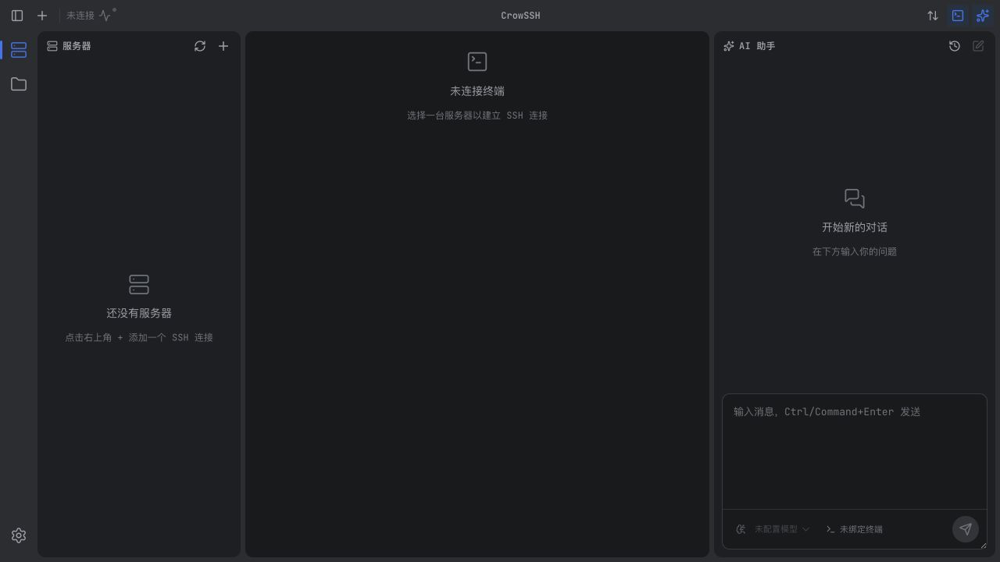
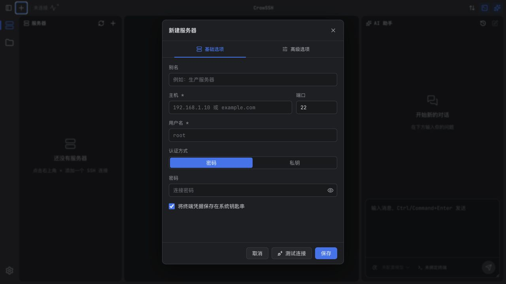
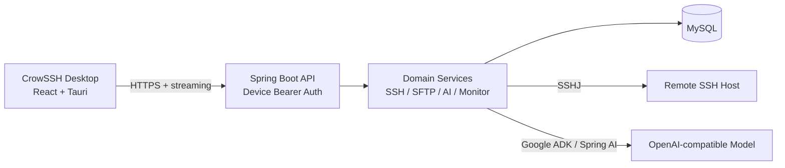

<div align="center">
  
  <h1>CrowSSH</h1>
  <p><strong>面向桌面端的现代化 SSH 工作台</strong></p>
  <p>在一个安静、可扩展的界面中管理 SSH 终端、远程文件、服务器监控与 AI 辅助运维。</p>

  <p>
    
    
    
    
    
  </p>
</div>

## 界面预览





> 截图由隔离的本地演示接口生成，仅展示空白界面和通用占位内容，不包含真实服务器、IP、账号、文件路径、会话、设备令牌或密钥。

## 核心能力

| 模块 | 能力 |
| --- | --- |
| SSH 终端 | 多标签会话、终端尺寸同步、重连、清屏、语义高亮与 URL 快捷打开 |
| 远程文件 | SFTP 浏览、上传、下载、新建、重命名、删除、权限修改、压缩与解压 |
| 远程编辑 | 独立编辑窗口、语法支持、自动换行、重新加载与保存 |
| AI 助手 | OpenAI 兼容模型配置、流式回答、会话历史、终端绑定与工具执行过程展示 |
| 操作防护 | 危险命令审批、执行取消、SSH 主机指纹确认和服务端归属校验 |
| 运行观测 | CPU、内存、磁盘与网络状态采集，文件传输进度和失败重试 |
| 桌面体验 | 深色/浅色主题、可调整三栏布局、Windows 自绘标题栏、macOS 原生窗口 |
| 发布工程 | macOS 签名与公证、Windows Authenticode、Tauri Updater 和回滚清单 |

## 系统架构



客户端与服务端分离维护：

| 目录 / 模块 | 职责 |
| --- | --- |
| `crowssh-client` | React 19、TypeScript、Vite、Tauri 2、xterm.js、CodeMirror 与 Zustand |
| `crowssh-server-api` | 对外接口契约与 DTO |
| `crowssh-server-trigger` | REST、流式聊天与命令审批入口 |
| `crowssh-server-case` | 应用用例编排 |
| `crowssh-server-domain` | SSH、SFTP、AI ReAct、会话上下文与安全规则 |
| `crowssh-server-infrastructure` | SSHJ、MyBatis、凭据加密与外部适配器 |
| `crowssh-server-app` | Spring Boot 启动、认证、CORS 与环境配置 |

## 安全设计

- 每次安装使用独立设备身份；服务端以认证主体为准执行连接、终端、SFTP 与 AI 资源归属校验。
- SSH 密码、私钥和 AI API Key 可保存在操作系统钥匙串中，前端状态只保存非敏感元数据。
- SSH 主机密钥采用指纹确认与固定校验，指纹变化时要求用户重新确认。
- 服务端默认阻止回环、链路本地和未授权私网 SSH 目标；受控内网目标需显式加入允许列表。
- 服务端凭据使用 AES-256-GCM 加密，并要求生产环境提供独立的 Base64 32 字节主密钥。
- AI 工具执行支持危险命令审批、拒绝、取消和执行状态回传。

## 开发环境

### 前置依赖

- Node.js 22 与 npm
- Rust stable 与 [Tauri 2 系统依赖](https://v2.tauri.app/start/prerequisites/)
- JDK 17 与 Maven 3.9+
- MySQL 8.x

### 1. 启动服务端

准备 `crowssh` 数据库和当前数据模型所需表结构，然后配置环境变量：

```bash
cd crowssh-server

export CROWSSH_DB_URL="jdbc:mysql://127.0.0.1:3306/crowssh?useUnicode=true&characterEncoding=utf8&serverTimezone=UTC&useSSL=true"
export CROWSSH_DB_USERNAME="crowssh"
export CROWSSH_DB_PASSWORD="change-me"
export CROWSSH_CRYPTO_PRIMARY_KEY="$(openssl rand -base64 32 | tr -d '\n')"

mvn -B -ntp test
mvn -B -ntp -DskipTests package
java -jar "crowssh-server-app/target/ai-agent-scaffold-app.jar" --spring.profiles.active=dev
```

服务默认监听 `http://127.0.0.1:8091`。生产部署必须使用 HTTPS 反向代理，并通过环境变量收紧 CORS、设备注册与 SSH 出站策略。

### 2. 启动客户端

```bash
cd crowssh-client
npm ci

VITE_CROWSSH_API_BASE_URL="http://127.0.0.1:8091" npm run dev
```

运行桌面客户端：

```bash
VITE_CROWSSH_API_BASE_URL="http://127.0.0.1:8091" npm run tauri -- dev
```

生产构建仅接受 HTTPS API 地址：

```bash
VITE_CROWSSH_API_BASE_URL="https://api.example.com" npm run tauri -- build
```

## 质量检查

客户端：

```bash
npm run check
npm run build
cargo test --locked --manifest-path "src-tauri/Cargo.toml"
```

服务端：

```bash
bash "scripts/security-check.sh"
mvn -B -ntp test
```

需要真实数据库、SSH 主机和模型密钥的集成测试通过受保护的 GitHub Environment 手动运行，避免把凭据写入代码、日志或公开工作流。

## 参与贡献

1. 从一个聚焦的问题或功能开始，避免在同一个变更中混入无关重构。
2. 提交前运行对应仓库的质量检查，并为行为变更补充测试。
3. 不要提交 `.env`、数据库转储、真实服务器信息、SSH 私钥、API Key 或包含隐私的截图。
4. 安全问题请通过私密渠道报告，不要在公开 Issue 中附带凭据或可利用细节。

## 项目状态

CrowSSH 仍在持续开发。公开部署前请补齐数据库版本化迁移与仓库根级 `LICENSE`，并在隔离环境完成真实 SSH、SFTP、AI、断线重连和安装包冒烟测试。已通过的单元测试或构建不等同于生产环境验证。
